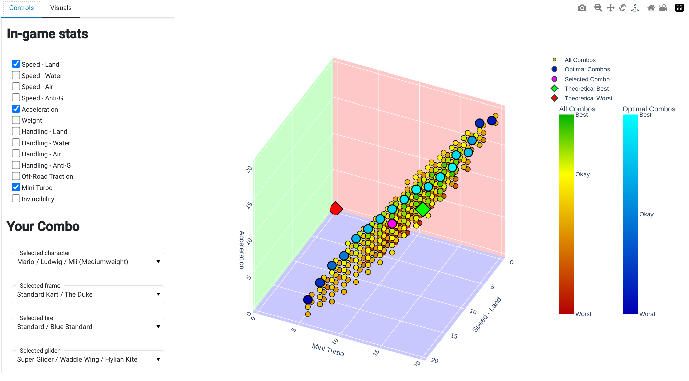
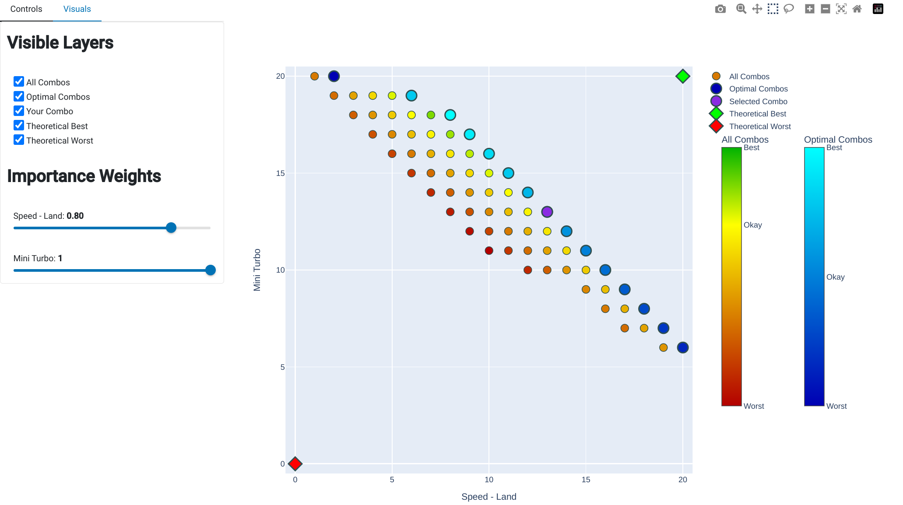
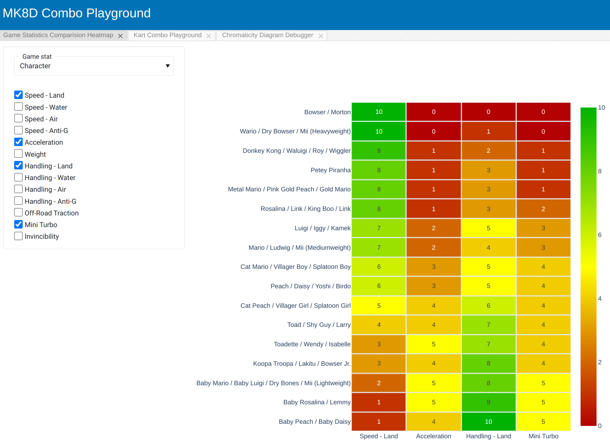

# Mario Kart 8 Deluxe - Combo Playground

Live Website: https://mk8d-combo-playground.herokuapp.com

A playground to explore optimal Mario Kart 8 combos via Pareto Optimization and fancy plots. This repository contains 2 notebooks, one for scraping the various in-game stats from `japan-mk.blog.jp` and one for setting up the combo playground visualizer.

## Features
* Given 2 or 3 important in-game statistics to inspect...
    * Visualize all combos within the parameter space and see how the stack against each other.
    * Show pareto-optimal combos based on selected stats and find the best one based on what stats matter to you (via importance weights).
    * Tweak the importance weights of stats to compare & contrast viability of builds for different game scenarios (VS races vs Time Trials).
    * Click on any scatterpoint to see a table of all the possible combos (*not shown in pics*).
    * Choose your preferred build and see how it stacks up against the rest of the combos.
* Compare in-game statistics for each part category (characters, frames, tires, and gliders) via the comparision heatmap.

### Notes
* The coloring for all combos is defined such that the middle color (yellow) is defined at the 70th percentile point to exaggerate the differences for near-meta builds.
* The importance weights will also reflect on the pareto-optimal combos as well.

## Kart Combo Playground

### With 3 features selected...

### With 2 features selected...

## In-game Statistics comparision heatmap

## Setup

### Option 1: Commandline (recommended)

1. (Setup & activate virtual python 3.x environment)
2. `pip install -U pip`
3. `pip install -r requirements.txt`
4. `jupyter nbconvert --execute --debug --clear-output notebooks/01_scrape_data.ipynb`
5. `panel serve notebooks/02_analyze_combos.ipynb --warm --reuse-sessions --global-loading-spinner`

### Option 2: Jupyter Lab

1. (Setup & activate virtual python 3.x environment)
2. `pip install -U pip`
3. `pip install -r requirements.txt`
4. `jupyter lab`
5. (Run all cells in `notebooks/01_scrape_data.ipynb`)
6. (Run all cells in `notebooks/02_analyze_combos.ipynb`)