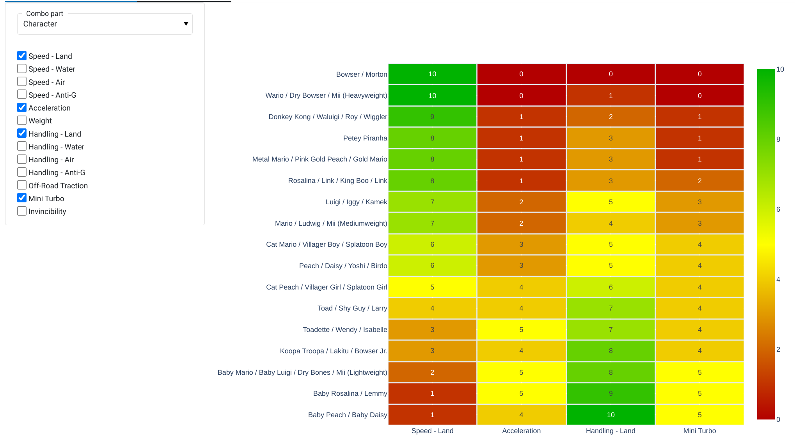

# Mario Kart 8 Deluxe - Combo Playground

Live Website: https://app.mk8d-combo-playground.com

A playground to explore optimal Mario Kart 8 build via Pareto Optimization and fancy plots. This repository contains 2 notebooks, one for scraping the in-game stats from `japan-mk.blog.jp` and one for setting up the combo playground visualizer.

*NOTICE*: The plots on the live website will take a few seconds to regenerate when changing the parameters or controls. **PLEASE. BE. PATIENT.**

## Features
Let's say you want to find the best kart build based on 2 or 3 in-game stats. With this playground you can...
* Visualize all possible builds and see how they stack against each other based on selected stats.
    
* View all pareto-optimal combos and find the best one based on what stats matter to you (via the importance weights).
    
* Click on any scatterpoint to see a table of all the possible builds matching the selected stats.
    
* Choose your preferred build and see how it stacks up against the rest.
    
* Compare in-game statistics for each part category (characters, frames, tires, and gliders) via the comparision heatmap.
    

### Notes
* The coloring for all combos is defined such that the middle color (yellow) is defined at the 70th percentile point to exaggerate the differences for near-meta builds.

## Setup

### Option 1: Commandline (recommended)

1. (Setup & activate virtual python 3.x environment)
2. `pip install -U pip`
3. `pip install -r requirements.txt`
4. `jupyter nbconvert --execute --debug --clear-output notebooks/01_scrape_data.ipynb`
5. `panel serve notebooks/02_analyze_combos.ipynb --warm --reuse-sessions --global-loading-spinner`

### Option 2: Jupyter Lab

1. (Setup & activate virtual python 3.x environment)
2. `pip install -U pip`
3. `pip install -r requirements.txt`
4. `jupyter lab`
5. (Run all cells in `notebooks/01_scrape_data.ipynb`)
6. (Run all cells in `notebooks/02_analyze_combos.ipynb`)

## More resources
* Mario Kart 8 Deluxe Builder (Tobias Mattsson) - https://mk8dxbuilder.com/
* Bayesic's Original Build Optimizer (Bayesic) - https://bayesicmk8dx.shinyapps.io/mk8_build_optimizer/